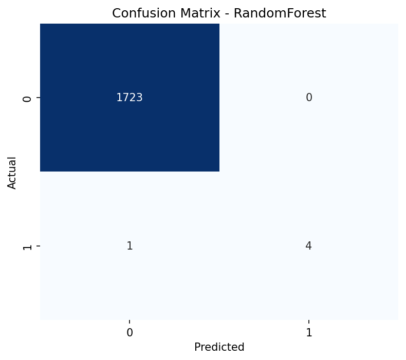
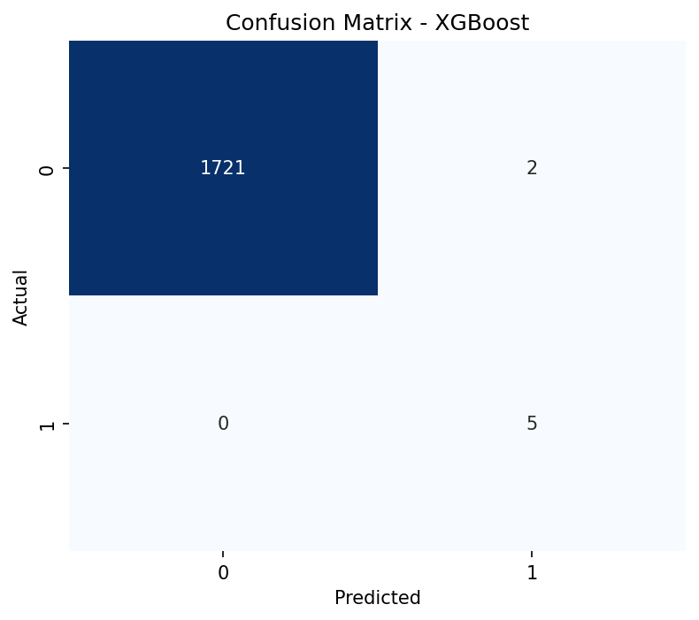
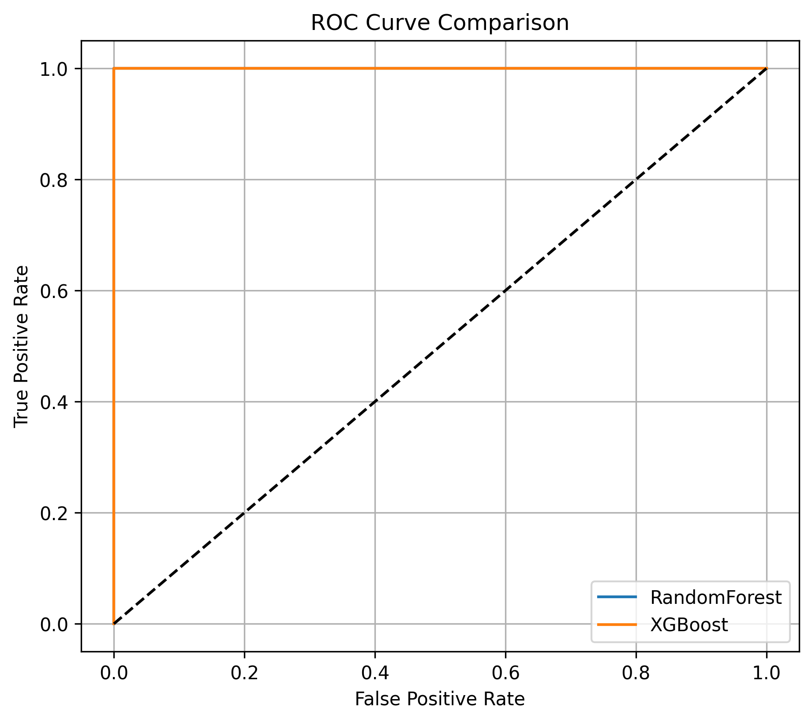
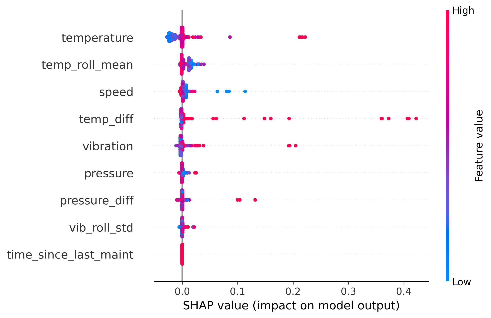
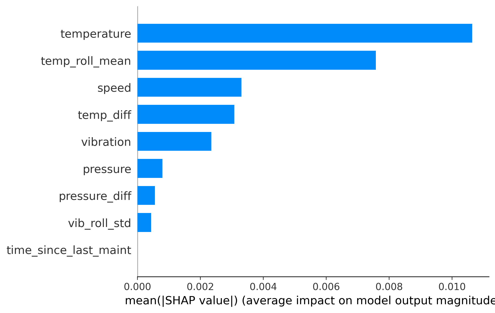
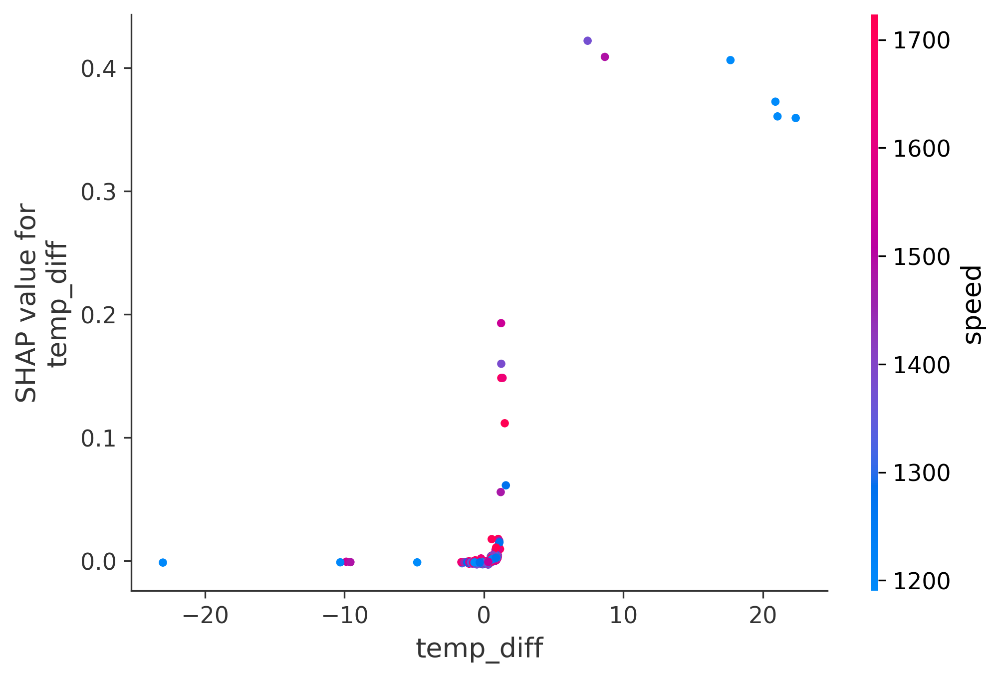
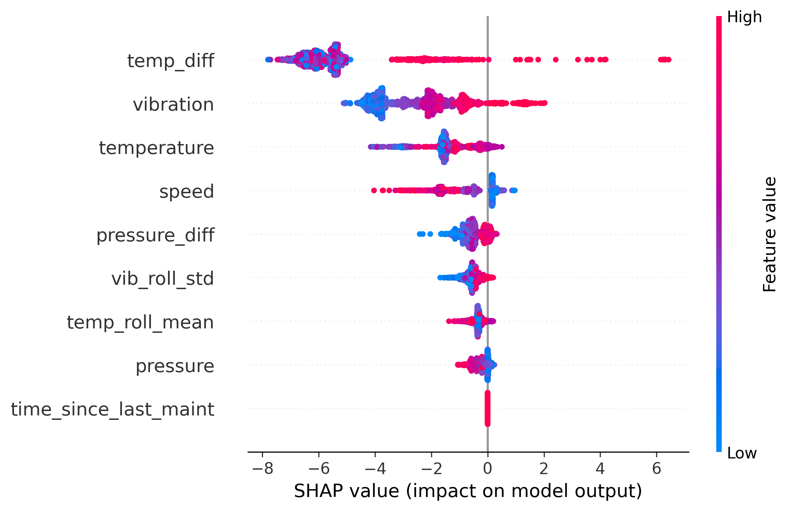
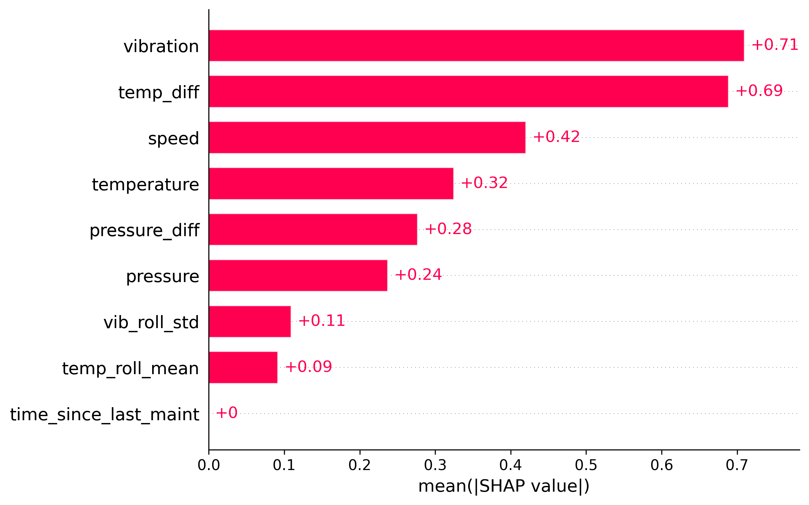
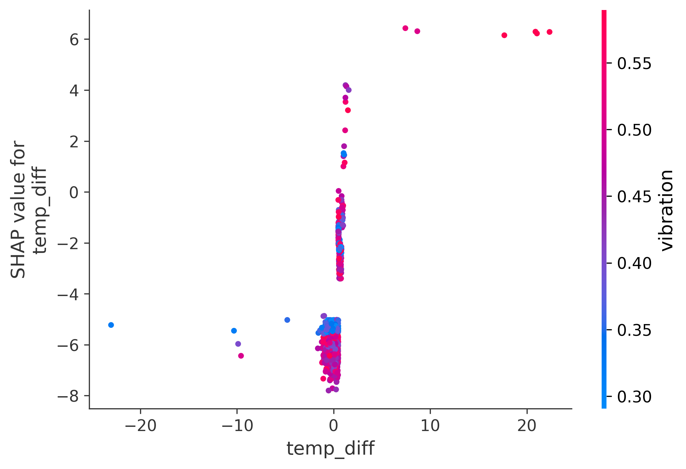

# Industrial Data Pipeline (Predictive Maintenance)
 
A complete Machine Learning pipeline for industrial sensor data to predict equipment failures using RandomForest and XGBoost, including:

✔ Synthetic Data Generation  
✔ Preprocessing & Feature Engineering  
✔ Binary Classification Model Training  
✔ Model Performance Comparison  
✔ SHAP Explainability  
✔ Complete GitHub Version Control


## 📂 Project Structure
IndustrialDataPipeline2/
│
├── data/
│   ├── raw/              # synthetic original dataset
│   ├── processed/        # cleaned + engineered dataset
│
├── notebook/
│   ├── 01_generate_dataset.ipynb
│   ├── 02_preprocess.ipynb
│   ├── 03_train_model.ipynb
│   ├── 04_model_evaluation.ipynb
│
├── models/               # saved ML models (.pkl)
├── results/              # evaluation plots exported here
└── .gitignore            # ignore unnecessary files


📌 Raw & processed data → ignored in Git using .gitignore  
📌 Notebook includes step-by-step ML pipeline

### 📊 Model Performance Summary

| Metric       | RandomForest | XGBoost |
|-------------|-------------|---------|
| Accuracy    | 0.9994      | 0.9988  |
| Recall      | 0.80        | 1.00    |
| F1-score    | 0.89        | 0.83    |
| ROC-AUC     | 1.00        | 1.00    |


## Visual Evaluation

### 🔹 Confusion Matrix

RandomForest:


XGBoost:



### 🔹 ROC Curve Comparison



---

##  SHAP Model Explainability

### RandomForest

| Plot | Visualization |
|------|---------------|
| Summary Plot |  |
| Bar Plot |  |
| Dependence Plot |  |

---

### XGBoost

| Plot | Visualization |
|------|---------------|
| Summary Plot |  |
| Bar Plot |  |
| Dependence Plot |  |

---

## Tech Stack
- Python (NumPy, Pandas)
- Scikit-learn
- XGBoost
- SHAP
- Matplotlib / Seaborn
- Git & GitHub

---

## Conclusion

RandomForest achieved:
- Better Precision & F1-score → safer decisions
- Clearer explainability with SHAP

XGBoost achieved:
- Higher Recall → detects all failures
- Slightly more false alarms

👉 Final recommendation:  
Use RandomForest for critical industrial equipment where false negatives must be avoided.

---
..
🎯 Future Work:
✔ Deploy real-time monitoring dashboard  
✔ Handle class imbalance with SMOTE  
✔ Add LSTM Time-Series modeling  

---

## 🚀 How to Run

```bash
git clone https://github.com/sahardolatyar220/IndustrialDataPipeline2.git
cd IndustrialDataPipeline2
conda create -n idp python=3.10 -y
conda activate idp
pip install -r requirements.txt
jupyter notebook


## 👩‍🔬 Author
Sahar Dolatyar  
Predictive Maintenance & Machine Learning Engineer  


